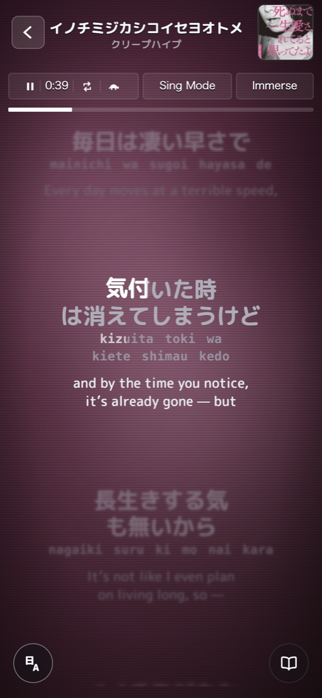
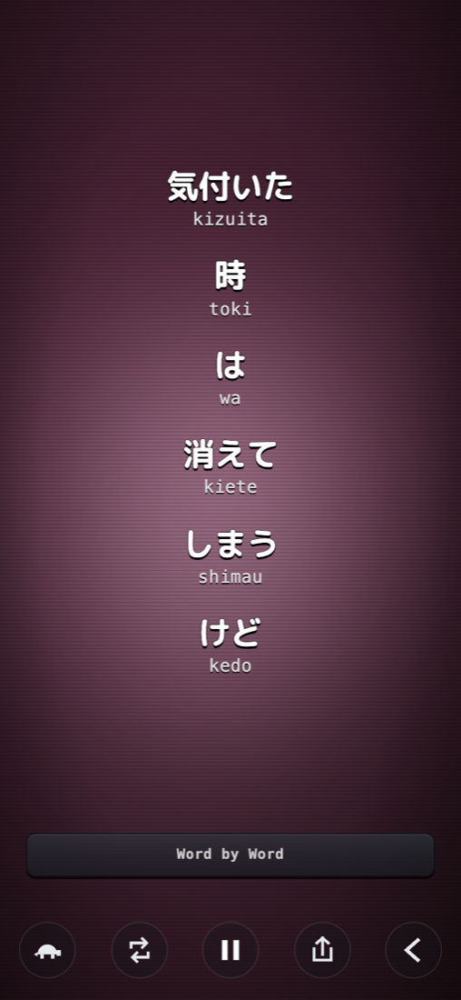
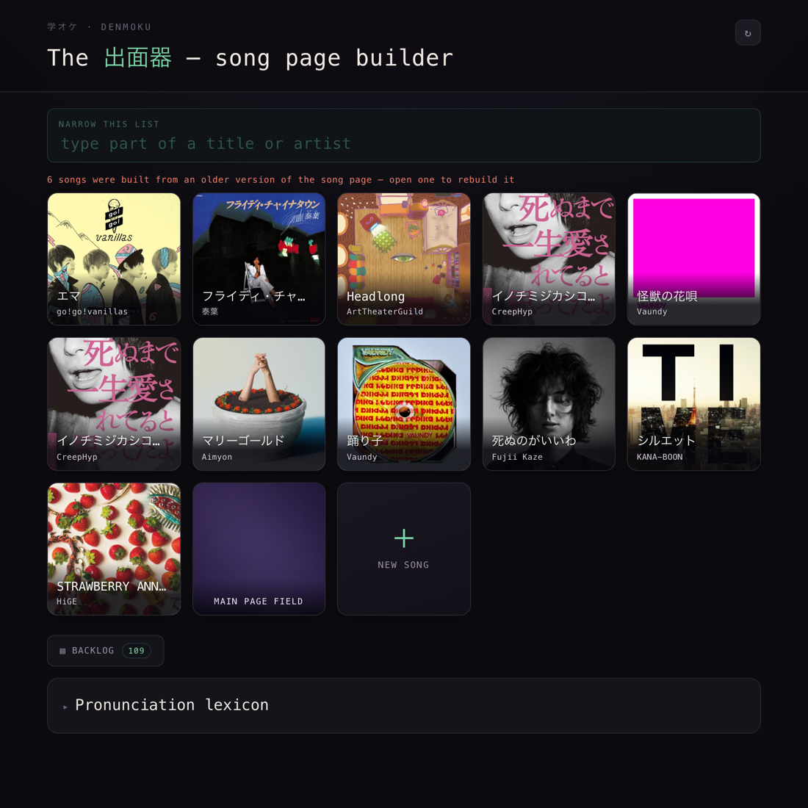
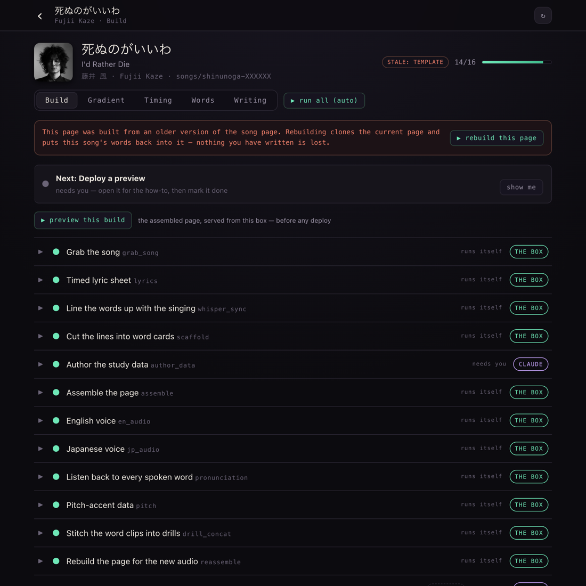
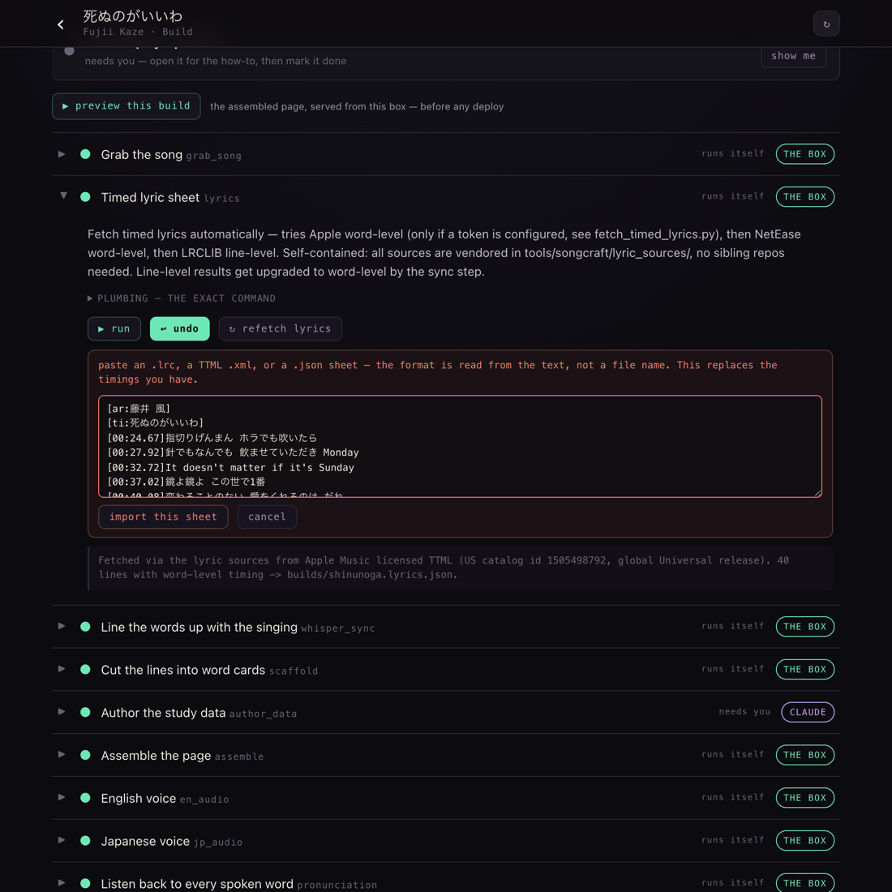
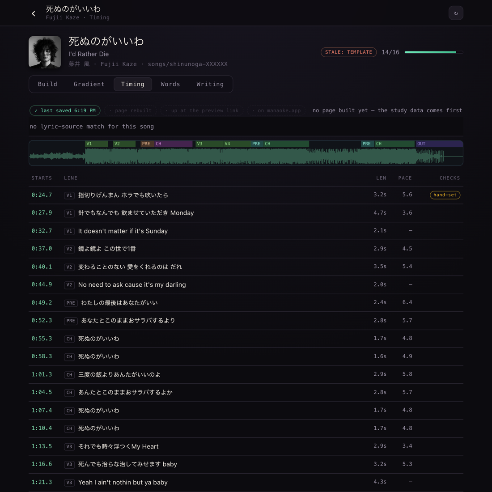

# Manaoke Engine

Build your own karaoke that teaches you a song.

You point it at a song and a timed lyric sheet. It gives you back one
self-contained HTML page where the words light up as they're sung, the romaji
wipes along underneath, the translation sits below, and every line opens into
word-by-word study cards with readings, glosses and pitch accent.

It runs **entirely on your own machine**. There's a local builder with a browser
UI, and it serves the finished page back to you before anything is deployed
anywhere. Nothing has to be published for it to work.

[manaoke.app](https://manaoke.app) is just one library built with it — an example
of the output, not a service you sign up for.

---

### What it makes

The page, mid-line. Sung words are white, unsung stay grey, and the wipe crosses
letter boundaries rather than jumping word to word. Lines above and below blur
by distance so your eye stays on the one being sung.



Tap any line and it opens into the words it's made of, each with its reading.



---

### What you drive it with

Denmoku, the local builder. Your library lives here; a song is a row of steps.



Each song is a sequence you can run one step at a time or all at once — fetch the
sheet, line the words up with the singing, cut them into cards, render the
voices, check every rendered word actually says the right thing, assemble.



**Bring your own sheet.** The automatic sources look a song up by name, so a song
none of them has heard of has no way in. This is that way in: paste an `.lrc`,
a TTML `.xml`, or a `.json` and it reads the format from the content, not the
file name. On the command line that's
`fetch_timed_lyrics.py <key> --source file --file <sheet>`.



**Then shape it.** A sheet is a starting point, not the final word. Drag a word on
the vocal waveform, mark a held vowel, retext or delete a token. Every edit lands
in a replayable sidecar, so re-aligning or re-importing re-applies your decisions
instead of clobbering them. A pipeline that overwrites a human decision is broken.



---

### Where timing comes from

Cheapest free source first, then the aligner earns its way up.

1. **LRCLIB** — keyless, open API, line-level timing.
2. **Forced alignment** (`whisper_sync.py --words`) — Demucs pulls the vocal out of
   the mix, then a CTC aligner is asked *when each known word is sung*. It doesn't
   guess what it hears; it already has the words. This is what turns a line-level
   sheet into word-level.
3. **Your own sheet** — anything you already have.

Everything downstream is source-agnostic from the moment the sheet lands, so an
imported sheet walks exactly the same road as a fetched one.

Other projects fetch and author these sheets —
[amll-ttml-tool](https://github.com/amll-dev/amll-ttml-tool) is a syllable-level
editor, [YouLy+](https://github.com/ibratabian17/YouLyPlus) renders word-by-word
lyrics. This one takes the sheet you bring.

---

### Getting started

```bash
python3 tools/songcraft/manaoke_build.py doctor      # what's installed, what's missing
python3 tools/songcraft/manaoke_build.py init <key>  # start a song
cd tools/songcraft/builder && python3 server.py      # the builder, at 127.0.0.1:8773
```

`doctor` is the honest one — it tells you which models, binaries and datasets you
still need, and which steps degrade rather than fail without them. Warnings are
runnable; failures are not.

The page itself is vanilla HTML, CSS and JavaScript. No npm, no framework, no
build step. The pipeline around it is Python 3.

### Reading order

- `tools/songcraft/BUILDER.md` — the step sequence and how to drive it
- `tools/songcraft/SONG-CONTRACT.md` — what a finished page has to satisfy
- `tools/data_schema_example.json` — the shape of a song's `data.json`
- `tools/songcraft/docs/` — the builder's API and the Timing Studio design

### What isn't here

No lyrics, no translations, no song audio, no album art. The engine reads those
from a `data.json` you supply. The page template ships with its content fields
emptied out and its identity as placeholders.

See `THIRD-PARTY.md` for the vendored dictionaries and fonts and their terms.

### Licence

MIT — see `LICENSE`. That covers this project's own code. The vendored
dictionaries and fonts keep their own terms; see `THIRD-PARTY.md`.

Lyrics, translations and recordings are not covered by anything here, because
none of them are here. Whatever you feed the engine stays your problem.

### Status

Extracted from a working private repository. Still missing one example song that
can legally ship, so a fresh clone has the machinery but nothing to build yet.
